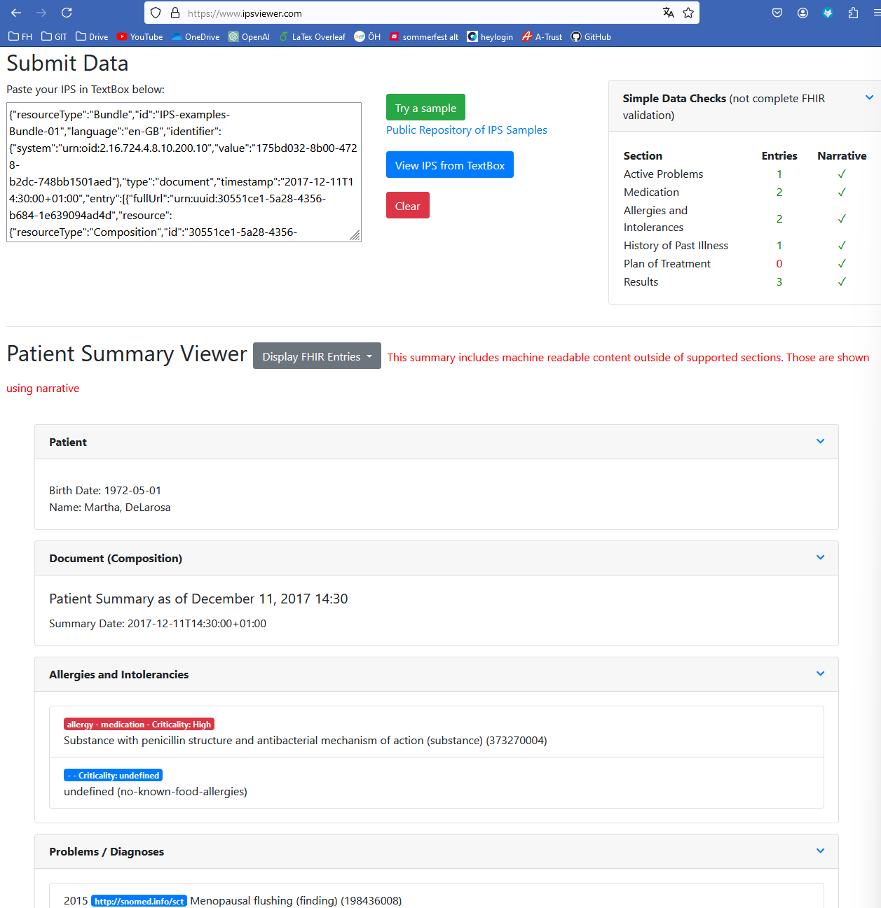
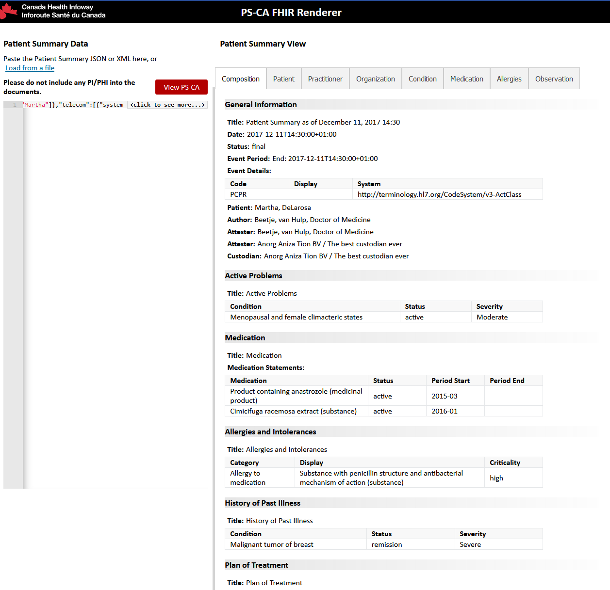
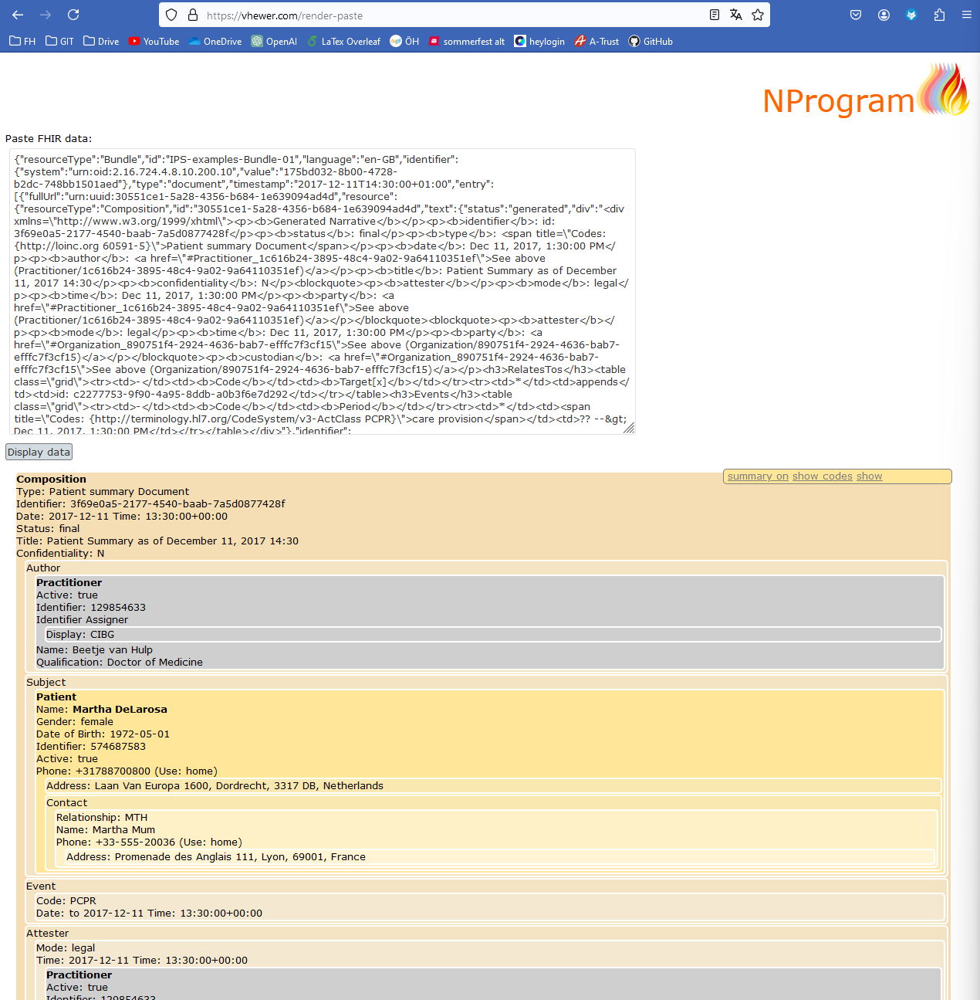

# IPS Viewer overview
This document contains an overview of existing Viewers for the International or National Patient Summaries that can be found on the internet and are publicly available.
✅❌
## IPS Viewer.com
### General Info
- Link to viewer: https://www.ipsviewer.com/
- Public Respository: ✅ (https://github.com/jddamore/IPSviewer)
- Data Input
  - Paste Resource ✅
  - Upload File ❌
  - Url to resource ❌
- Search/Filter: ❌
- Diagrams: ❌

### Description
This IPS viewer was developed for a Connectathon and the source code is availabe on the website above. The user can paste in an IPS Bundle, to render the IPS below. The Content is structured according to the Sections of the document, and each Section can be collapsed.

The viewer also does a simple data check, displaying a table with the counted entries per section.

It was developed using node.js JavaScript

### Screenshot

## PS Canadian Viewer
### General Info
- Link to viewer: https://ps-ca-renderer.apibox.ca/index.html
- Public Respostory: ❌
- Data Input
  - Paste Resource ✅
  - Upload File ❌
  - Url to resource ❌
- Search/Filter: ❌
- Diagrams: ❌

### Description
This Patient Summary Viewer is an Canadian initiative with the primary goal to visualize the Canadian patient summary. The user can also paste in an IPS Bundle. The Visualization is also structured according to the structure of the IPS. Each sections has its own tab. The content is displayed in a mix of textual content and tables. 

### Screenshot

## PS Canadian Viewer
### General Info
- Link to viewer: https://ps-ca-renderer.apibox.ca/index.html
- Public Respostory: ❌
- Data Input
  - Paste Resource ✅
  - Upload File ✅
  - Url to resource ✅
- Search/Filter: ❌
- Diagrams: ❌

### Description
This IPS viewer was developed by some british guy named [Rik Smithies](https://uk.linkedin.com/in/riksmithies?original_referer=http%3A%2F%2Fwww.nprogram.co.uk%2F). Besides that I found no further information about the viewer or implementation.

### Screenshot

