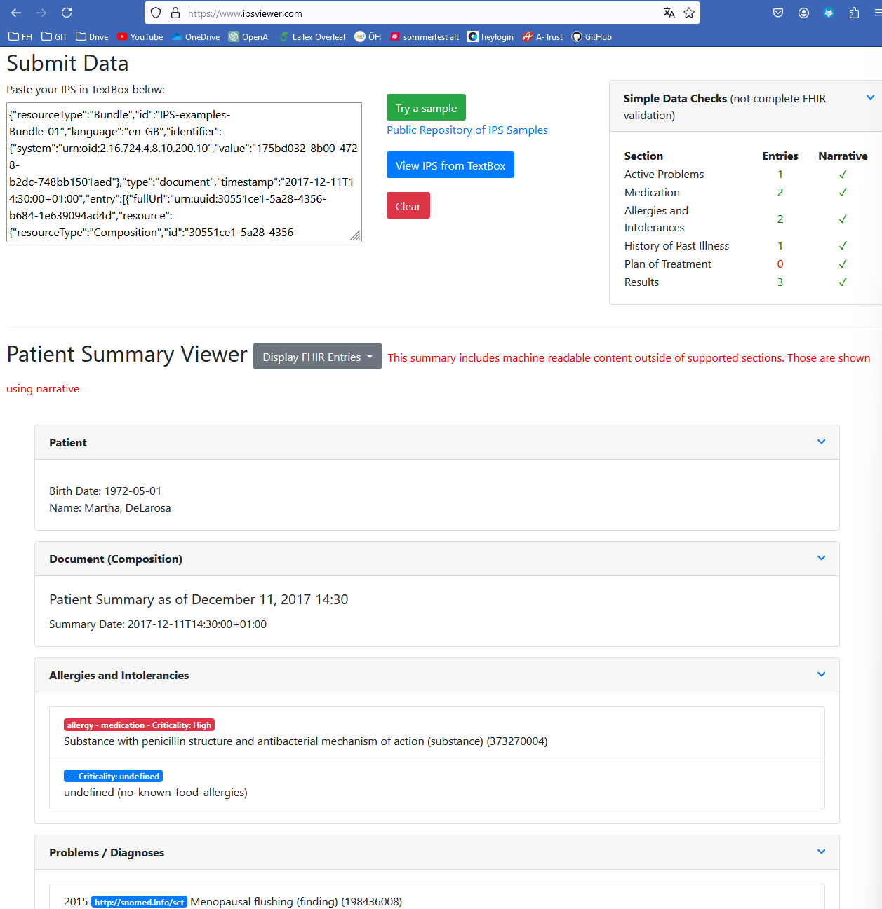
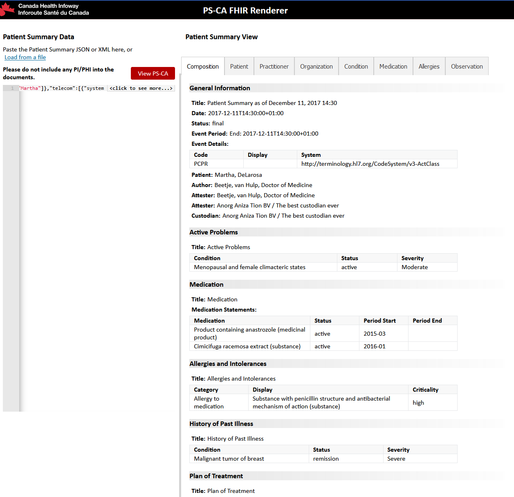
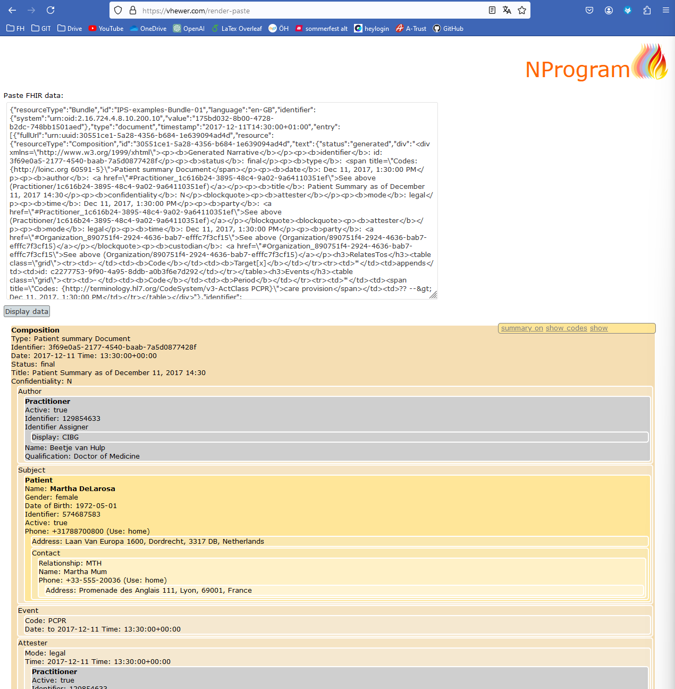
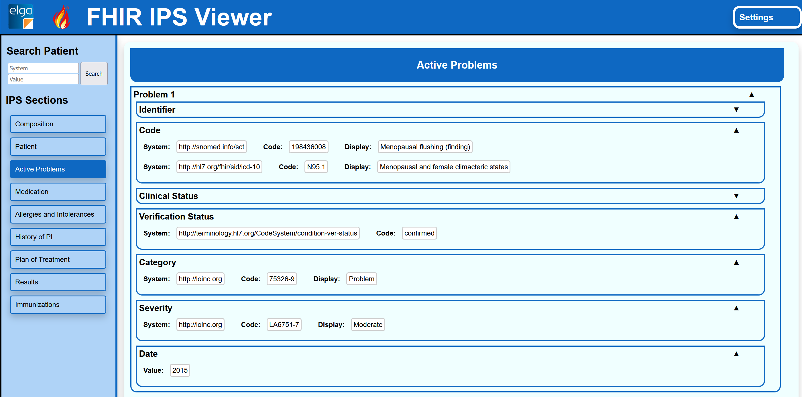

# IPS Viewer overview

This document contains an overview of existing Viewers for the International or National Patient Summaries that can be found on the internet and are publicly available.  ✅❌  
 
| Viewer                                                            | Repository                                        | Input                                     | Search/Filters | Diagrams |
|-------------------------------------------------------------------|---------------------------------------------------|-------------------------------------------|-------------|----------|
| [IPS Viewer.com](https://www.ipsviewer.com/)                      | ✅ [(link)](https://github.com/jddamore/IPSviewer) | Paste Resource ✅   Upload File ❌   Url to resource ❌ |        ❌     |    ❌      |
| [PS Canadian Viewer](https://ps-ca-renderer.apibox.ca/index.html) |             ❌                                      |           Paste Resource ✅   Upload File ❌   Url to resource ❌                                |        ❌     |     ❌     |
| [FHIR VHEWER](https://vhewer.com/render-paste)                    |                    ❌                               |         Paste Resource ✅   Upload File ✅   Url to resource ✅                                  |       ❌      |     ❌     |
| [IPS Viewer Robin]([https://www.ipsviewer.com/](https://gitlab.com/RobinBerger1/fhir-ips-visualization))| ✅ |  Paste Resource ❌   Upload File ❌   Url to resource ✅  |❌ | ❌ |

## IPS Viewer.com
### General Info
- Link to viewer: https://www.ipsviewer.com/
- Public Repository: ✅ (https://github.com/jddamore/IPSviewer)
- Data Input
  - Paste Resource ✅
  - Upload File ❌
  - Url to resource ❌
- Search/Filter: ❌
- Diagrams: ❌

### Description
This IPS viewer was developed for a Connectathon and the source code is available on the website above. The user can paste in an IPS Bundle, to render the IPS below. The Content is structured according to the Sections of the document, and each Section can be collapsed.

The viewer also does a simple data check, displaying a table with the counted entries per section.

It was developed using node.js JavaScript

### Screenshot

## PS Canadian Viewer
### General Info
- Link to viewer: https://ps-ca-renderer.apibox.ca/index.html
- Public Repository: ❌
- Data Input
  - Paste Resource ✅
  - Upload File ❌
  - Url to resource ❌
- Search/Filter: ❌
- Diagrams: ❌

### Description
This Patient Summary Viewer is an Canadian initiative with the primary goal to visualize the Canadian patient summary. The user can also paste in an IPS Bundle. The Visualization is also structured according to the structure of the IPS. Each sections has its own tab. The content is displayed in a mix of textual content and tables. 

### Screenshot

## FHIR VHEWER
### General Info
- Link to viewer: https://vhewer.com/render-paste
- Public Repository: ❌
- Data Input
  - Paste Resource ✅
  - Upload File ✅
  - Url to resource ✅
- Search/Filter: ❌
- Diagrams: ❌

### Description
This IPS viewer was developed by some british guy named [Rik Smithies](https://uk.linkedin.com/in/riksmithies?original_referer=http%3A%2F%2Fwww.nprogram.co.uk%2F). Besides that I found no further information about the viewer or implementation.

### Screenshot

## IPS Viewer Robin
### General Info
- Link to viewer: ❌ Need to start locally
- Public repository ✅ Ask Robin for insight
- Data Input
  - Paste Resource ❌
  - Upload File ❌
  - Url to resource ✅
- Search/Filter ❌
- Diagrams ❌

### Description
This IPS viewer is the one Robin developed as part of his Bachelor thesis. The Website was developed using plain React (no framework such as next.js etc). Only certain sections are implemented, so the visualization is incomplete.

### Screenshot

